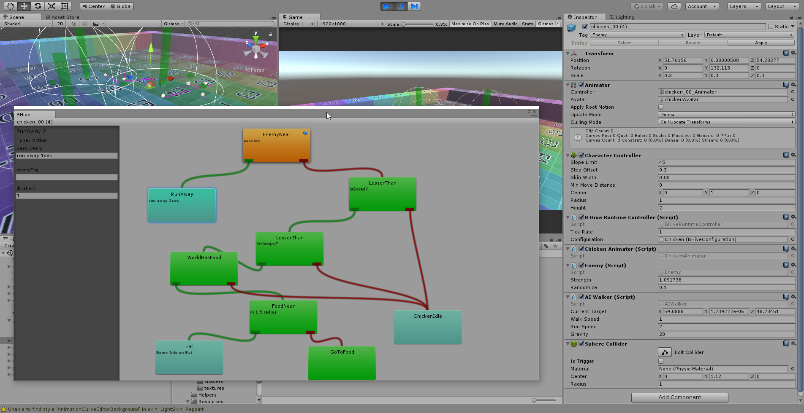

# unity-bhive
Behaviour Tree AI System

This is an AI system for behaviour tree AI in unity. This is only a proof of concept and not at all production ready. 

# Requirements

* Blender (for example assets)
* Unity 5.5 or higher

<iframe src="https://player.vimeo.com/video/108706256" width="640" height="360" frameborder="0" webkitallowfullscreen mozallowfullscreen allowfullscreen></iframe>

<a href="https://vimeo.com/108706256">Chicken AI in Unity3D</a> from <a href="https://vimeo.com/kaiwegner">Kai Wegner</a> on <a href="https://vimeo.com">Vimeo</a>.

